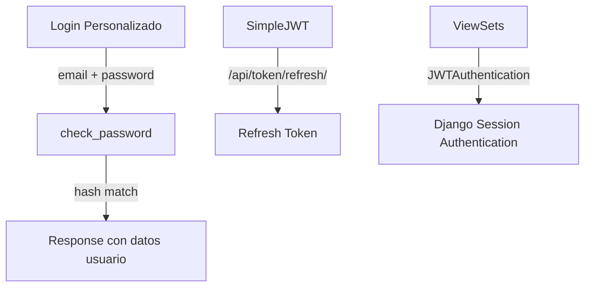

# Auditoría API Authentication — comunidad_zapotal_backend

**Fecha:** 2026-06-10 | **Método:** SimpleJWT + Login personalizado

---

## 1. ARQUITECTURA DE AUTENTICACIÓN



### 1.1 Flujo Actual vs Django Estándar

| Aspecto | Actual | Django Estándar |
|---------|--------|----------------|
| User model | `Usuario` (Model propio) | `AbstractUser` |
| Password hash | `make_password()` | `set_password()` |
| Login | `check_password()` manual | `authenticate()` |
| Sessions | No usado | `login()` |
| Permisos | No implementado | `request.user`, `@permission_required` |

### 1.2 Problemas de Arquitectura

```python
# settings.py:144 — COMENTADO
# AUTH_USER_MODEL = 'accounts.Usuario'
```

1. **AUTH_USER_MODEL está comentado** — Django `contrib.auth` funciona con su propio modelo `auth.User`
2. **Dos sistemas de usuarios conviven** — `auth.User` (Django admin) y `accounts.Usuario` (API)
3. **SimpleJWT no está integrado con `Usuario`** — usa el modelo definido por `AUTH_USER_MODEL`
4. **El login personalizado no emite JWT** — solo devuelve datos del usuario en JSON

---

## 2. LOGIN ENDPOINT — Análisis

### 2.1 Flujo Completo

```python
@api_view(['POST'])
@permission_classes([AllowAny])
def login_usuario(request):
    # 1. Valida email + password con LoginSerializer
    # 2. Busca usuario por email
    # 3. check_password (manual)
    # 4. Verifica estado ACTIVO
    # 5. Devuelve datos usuario (SIN JWT)
```

### 2.2 Problemas

1. ❌ **No emite JWT** — El login debería devolver `access` + `refresh` tokens
2. ❌ **User enumeration** — El mensaje "Correo o contrasena incorrectos." es seguro ✅, pero el código diferencia entre usuario no existe (404) vs password incorrecto (400) internamente
3. ❌ **No usa `authenticate()` de Django** — bypass total del sistema de auth
4. ❌ **Sin rate limiting** — LoginThrottle definido pero no aplicado
5. ⚠️ **HTTP 400 en vez de 401** para credenciales inválidas

### 2.3 User Enumeration

```python
try:
    usuario = Usuario.objects.get(email=email)
except Usuario.DoesNotExist:
    return Response(
        {'ok': False, 'mensaje': 'Correo o contrasena incorrectos.'},
        status=status.HTTP_400_BAD_REQUEST,  # ← Mismo mensaje, mismo status
    )

if not check_password(password, usuario.password):
    return Response(
        {'ok': False, 'mensaje': 'Correo o contrasena incorrectos.'},
        status=status.HTTP_400_BAD_REQUEST,
    )
```

✅ **Bien:** Mismo mensaje y status code en ambos casos. No hay user enumeration.

---

## 3. JWT — Configuración

### 3.1 SimpleJWT Settings

```python
SIMPLE_JWT = {
    'ACCESS_TOKEN_LIFETIME': config('JWT_ACCESS_LIFETIME_MINUTES', default=60, cast=int) * 60,
    'REFRESH_TOKEN_LIFETIME': config('JWT_REFRESH_LIFETIME_DAYS', default=1, cast=int) * 86400,
}
```

### 3.2 Problemas

1. ❌ **Sin `ROTATE_REFRESH_TOKENS`** — Los refresh tokens no se rotan
2. ❌ **Sin `BLACKLIST_AFTER_ROTATION`** — No hay blacklist
3. ❌ **Sin `AUTH_HEADER_TYPES`** — Usa default `Bearer`
4. ❌ **Sin `AUTH_TOKEN_CLASSES`** — Usa default
5. ❌ **Sin `USER_ID_FIELD`** — Usa default `id`
6. ❌ **Sin `USER_ID_CLAIM`** — Usa default `user_id`
7. ⚠️ **Unidades inconsistentes** — `60*60` (minutos*60) vs `1*86400` (días*86400)

### 3.3 Configuración Recomendada

```python
SIMPLE_JWT = {
    'ACCESS_TOKEN_LIFETIME': timedelta(minutes=15),
    'REFRESH_TOKEN_LIFETIME': timedelta(days=7),
    'ROTATE_REFRESH_TOKENS': True,
    'BLACKLIST_AFTER_ROTATION': True,
    'AUTH_HEADER_TYPES': ('Bearer',),
    'AUTH_TOKEN_CLASSES': ('rest_framework_simplejwt.tokens.AccessToken',),
    'USER_ID_FIELD': 'id',
    'USER_ID_CLAIM': 'user_id',
}
```

---

## 4. PERMISOS

### 4.1 Estado Actual

```python
'DEFAULT_PERMISSION_CLASSES': [
    'rest_framework.permissions.IsAuthenticatedOrReadOnly',
]
```

- ✅ Safe methods (GET, HEAD, OPTIONS) son públicos
- ❌ Escritura requiere solo autenticación, no autorización
- ❌ No hay permisos por tipo de usuario (ADMIN/COMUNERO/USUARIO)
- ❌ No hay permisos por objeto (ownership)

### 4.2 Custom Permissions Necesarias

```python
class IsAdminUser(permissions.BasePermission):
    def has_permission(self, request, view):
        return request.user.is_authenticated and request.user.tipo_usuario == 'ADMIN'

class IsOwnerOrReadOnly(permissions.BasePermission):
    def has_object_permission(self, request, view, obj):
        if request.method in permissions.SAFE_METHODS:
            return True
        return obj.owner == request.user
```

---

## 5. RECOMENDACIONES — HOJA DE RUTA

### Corto Plazo (1-2 días)

1. **Descomentar `AUTH_USER_MODEL`** y migrar `Usuario` a `AbstractUser`
2. **Hacer que el login emita JWT** — usar `TokenObtainPairView` de SimpleJWT
3. **Aplicar `LoginThrottle`** al endpoint de login
4. **Configurar `ROTATE_REFRESH_TOKENS = True`**

### Mediano Plazo (1 semana)

5. **Migrar CharFields a ForeignKeys** en Mensaje, Notificación, Reacción
6. **Implementar permisos por rol** — `IsAdminUser`, `IsComuneroUser`
7. **Implementar permisos por objeto** — ownership checks
8. **Agregar blacklist de tokens JWT**

### Largo Plazo (1 mes)

9. **Implementar 2FA/MFA**
10. **Implementar OAuth2 social login**
11. **Sistema de API keys para integraciones externas**

---

## 6. Score API Authentication: 22/100

| Categoría | Peso | Score | Comentario |
|-----------|------|-------|------------|
| Arquitectura Auth | 25% | 10 | AUTH_USER_MODEL roto, bypass de Django |
| Login | 20% | 30 | Funciona pero sin JWT ni rate limit |
| JWT | 20% | 25 | Sin rotación, sin blacklist, sin refresh seguro |
| Permisos | 25% | 15 | Sin ROLES, sin object-level permissions |
| Best Practices | 10% | 40 | User enumeration mitigado, falta lo demás |
| **Total** | **100%** | **22** | **Requiere reestructuración completa del sistema de auth** |
