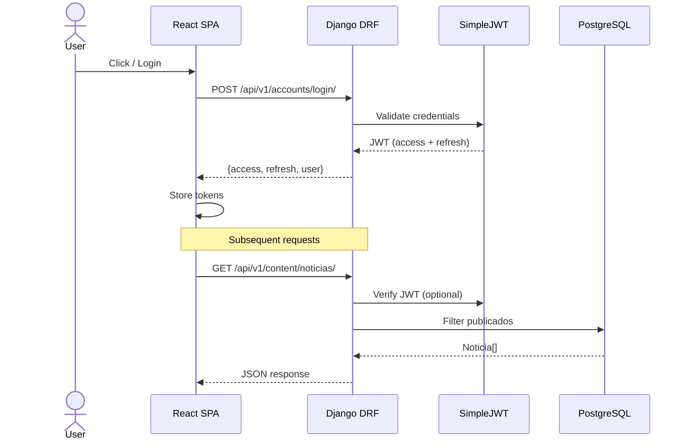

# Backend Architecture — Django REST API

```mermaid
graph TB
    subgraph Clients
        B[Browser SPA]
        M[Mobile/Postman]
    end

    subgraph Django["Django REST Framework"]
        U[zapotal_config/urls.py<br/>API Gateway]
        
        subgraph Middleware
            JWT[SimpleJWT Auth]
            CORS[django-cors-headers]
            THR[django-throttling]
            FIL[django-filter]
        end

        subgraph Apps["Django Apps"]
            A1[accounts<br/>Usuario + Auth]
            A2[content<br/>Noticia + Evento + Multimedia]
            A3[comunidad<br/>Autoridad + Comunidad]
            A4[messaging<br/>Mensaje + Notificacion]
            A5[reports<br/>Contacto + Reclamacion]
            A6[core<br/>Constants + Permissions]
        end

        subgraph DocsAPI["Documentation"]
            SW[Swagger UI<br/>/api/docs/]
            OA[OpenAPI Schema<br/>/api/schema/]
        end
    end

    subgraph Storage
        PG[(PostgreSQL<br/>dev: SQLite)]
        RD[Redis + Celery<br/>Async tasks]
        MD[/media/<br/>Uploaded files]
    end

    B -->|HTTP / JWT| U
    M -->|HTTP / JWT| U
    U --> JWT
    U --> CORS
    U --> Apps
    A1 --> PG
    A2 --> PG
    A2 --> MD
    A3 --> PG
    A4 --> PG
    A5 --> PG
    U --> DocsAPI
```

## Layer Flow



## Apps & Responsibilities

| App | Models | Key Endpoints |
|-----|--------|--------------|
| accounts | Usuario | login, register, profile |
| content | Noticia, Evento, Multimedia, Categoria, Comentario, Reaccion | CRUD noticias, eventos, comentarios |
| comunidad | Autoridad | listar autoridades |
| messaging | Mensaje, Notificacion | mensajeria interna |
| reports | Contacto, Reclamacion | formularios publicos |
| core | (logic layer) | validators, permissions, pagination |
