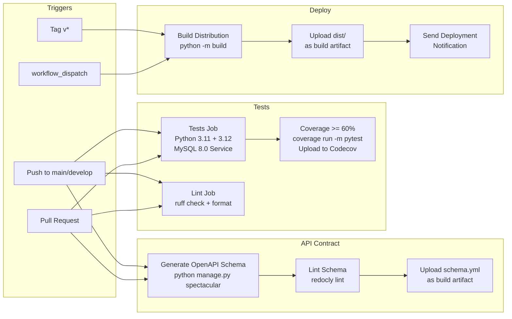

# CI/CD Pipeline

## Workflow Summary

| Workflow | File | Trigger | Jobs |
|----------|------|---------|------|
| Tests | `tests.yml` | Push/PR to main/develop | `test` (matrix: 3.11, 3.12 + MySQL 8.0), `lint` (ruff) |
| API Contract | `api-contract.yml` | Push/PR to main/develop | `validate-schema` (spectacular → redocly) |
| Deploy | `deploy.yml` | Tag `v*` or manual | `deploy` (build dist), `notify` (completion message) |

## Tests Job Details

| Step | Action |
|------|--------|
| Python setup | 3.11 + 3.12 matrix |
| Dependencies | pip install requirements.txt + requirements-dev.txt + coverage |
| Database | MySQL 8.0 container (root/root, DB: test_zapotal) |
| Environment | `DJANGO_DEBUG=False`, test secret key, MySQL connection vars |
| Execution | `coverage run -m pytest --tb=short -v` |
| Coverage threshold | `--fail-under=60` |
| Reporting | Upload XML to Codecov |

## Lint Job Details

| Step | Action |
|------|--------|
| Python setup | 3.11 |
| Tools | `ruff check .`, `ruff format --check .` |

## API Contract Details

| Step | Action |
|------|--------|
| Generate | `python manage.py spectacular --file schema.yml` |
| Validate | `redocly lint schema.yml` |
| Artifact | Upload `schema.yml` |

## Deploy Details

| Step | Action |
|------|--------|
| Build | `pip install build && python -m build` |
| Artifact | Upload `dist/` |
| Notify | Prints deployment tag completion |
