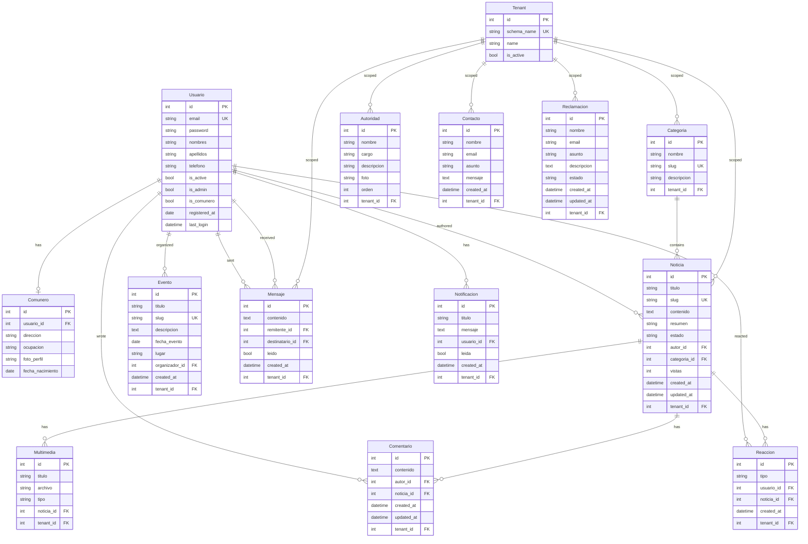

# Data Model — Entity Relationships

## Model Summary

| App | Models | Purpose |
|-----|--------|---------|
| accounts | Usuario | User auth, admin flags |
| accounts | Comunero | Extended profile (1:1) |
| content | Categoria | News categories |
| content | Noticia | News articles with estado workflow |
| content | Evento | Community events |
| content | Multimedia | Image/video attachments |
| content | Comentario | User comments on news |
| content | Reaccion | Like/dislike on news |
| comunidad | Autoridad | Community authorities |
| messaging | Mensaje | Direct messages between users |
| messaging | Notificacion | System notifications |
| reports | Contacto | Public contact form |
| reports | Reclamacion | Public complaints with estado |
