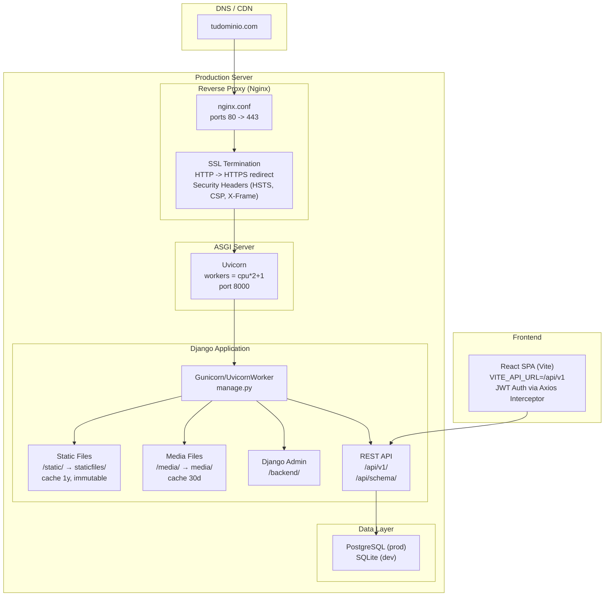

# Deployment / Infrastructure

## Locations

| Path | Type | Proxy/Alias | Cache |
|------|------|-------------|-------|
| `/api/` | Django REST API | `proxy_pass http://django` | No |
| `/backend/` | Django Admin | `proxy_pass http://django` | No |
| `/api/schema/` | OpenAPI/Swagger | `proxy_pass http://django` | No |
| `/media/` | User uploads | `alias /var/www/zapotal/backend/media` | 30d |
| `/static/` | Static assets | `alias /var/www/zapotal/backend/staticfiles` | 1y (immutable) |

## Uvicorn Configuration

| Parameter | Value |
|-----------|-------|
| Bind | `127.0.0.1:8000` |
| Workers | `cpu_count * 2 + 1` (env: `UVICORN_WORKERS`) |
| Worker class | `uvicorn.workers.UvicornWorker` |
| Timeout | 120s |
| Graceful timeout | 30s |
| Keepalive | 5s |
| Access log | `./logs/uvicorn_access.log` |
| Error log | `./logs/uvicorn_error.log` |

## Security Headers (Nginx)

| Header | Value |
|--------|-------|
| X-Frame-Options | `DENY` |
| X-Content-Type-Options | `nosniff` |
| X-XSS-Protection | `1; mode=block` |
| Referrer-Policy | `strict-origin-when-cross-origin` |
| Content-Security-Policy | `default-src 'self'; img-src 'self' data:; script-src 'self'; style-src 'self' 'unsafe-inline'` |
| Strict-Transport-Security | `max-age=31536000; includeSubDomains; preload` |
| Permissions-Policy | `geolocation=(), microphone=(), camera=()` |
| client_max_body_size | 10M |
