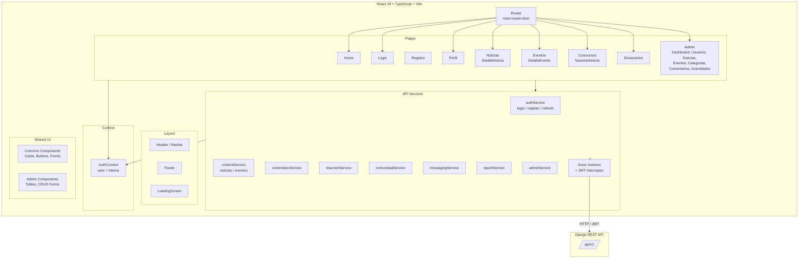

# Frontend Architecture — React SPA



## Page-to-API Map

| Page | Route | API Endpoints |
|------|-------|--------------|
| Login | /login | POST accounts/login/ |
| Registro | /register | POST accounts/register/ |
| Home | / | GET content/noticias/, content/eventos/ |
| Noticias | /noticias | GET content/noticias/, content/categorias/ |
| DetalleNoticia | /noticias/:id | GET content/noticias/:id, content/comentarios/ |
| Eventos | /eventos | GET content/eventos/ |
| DetalleEvento | /eventos/:id | GET content/eventos/:id |
| Conocenos | /nosotros | GET comunidad/autoridades/ |
| Perfil | /perfil | GET/PUT accounts/profile/ |
| Admin | /admin/* | CRUD content/*, accounts/*, comunidad/* |
| Donaciones | /donaciones | Redirect externo (Paga.pe) |

## Routing Tree

```
<App>
  <AuthProvider>
    <BrowserRouter>
      <Routes>
        /               → Home
        /login          → Login
        /register       → Registro
        /noticias       → Noticias
        /noticias/:id   → DetalleNoticia
        /eventos        → Eventos
        /eventos/:id    → DetalleEvento
        /nosotros       → Conocenos
        /nuestra-historia → NuestraHistoria
        /donaciones     → Donaciones
        /perfil         → Perfil (protected)
        /admin/*        → AdminLayout (protected, admin)
          /dashboard    → AdminDashboard
          /usuarios     → AdminUsuarios
          /noticias     → AdminNoticias
          /eventos      → AdminEventos
          /categorias   → AdminCategorias
          /comentarios  → AdminComentarios
          /autoridades  → AdminAutoridades
      </Routes>
    </BrowserRouter>
  </AuthProvider>
</App>
```
